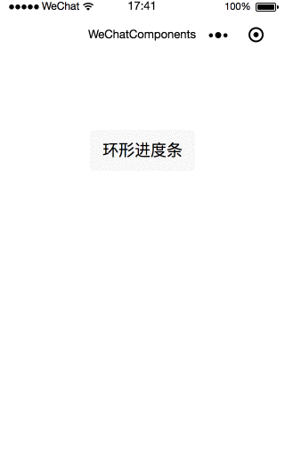

# wxAppUI
wechat app ui components



## 组件列表

  - circleProgress

### circleProgress(环形进度条)

```
  <circle-progress
    progress-id="firstProgressId"
    size="120"
    border-width="5"
    duration="2000"
    progress="25"
    max="100"
    background-color="#e2e2e2"
    border-color="red"
    show-progress="true"
    font-color="#000000"
    font-size="16"></circle-progress>
```

属性名 | 类型 | 默认值 | 说明
---- | ---- | --- | ---
progress-id | String | firstProgressId | 环形进度条id,唯一
size | Number | 100 | 大小，单位px
border-width | Number | 5 | 进度条宽度， 单位px
duration | Number | 2000 | 运动时长，单位ms
progress | Number | 2 | 进度
max | Number | 10 | 最大进度
background-color | String | #e2e2e2 | 底色
border-color | String | red | 进度条颜色
show-progress | Boolean | true | 是否展示进度
font-color | String | #000000 | 进度字体颜色
font-size | Number | 25 | 进度字体大小，单位px


## License

[MIT License](http://opensource.org/licenses/MIT)
